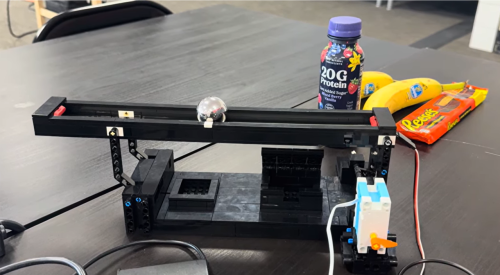

# BNB — Ball and Beam Reinforcement Learning (Sim2Real)

<p align="center">
  <a href="https://www.youtube.com/watch?v=wQ2SrcOREII">
    
  </a>
  <br>
  <em>👆 Click the image to watch the video on YouTube</em>
</p>

A Ball-and-Beam (BNB) balancing system trained with reinforcement learning in MATLAB/Simulink and deployed to real hardware (ESP32 + servo + SoftPot sensor).

The agent observes the ball's position and velocity on the beam and outputs a servo angle to keep the ball balanced (or move it to a target position).

For full documentation, hardware setup, and a step-by-step tutorial, please visit the [DASL Wiki](https://www.daslhub.org/unlv/wiki/doku.php?id=taeuksun_bnb).

## How it works

1. **Model & train** — A physical model of the beam (`bnbInit.m`) feeds a Simulink model (`bnbRL_Simulink.slx`) wrapped as a Gymnasium-style RL environment. A Soft Actor-Critic (SAC) agent is trained against it.
2. **Evaluate in sim** — The trained agent is simulated and animated to sanity-check behavior before touching hardware.
3. **Export weights** — The actor network's weights are exported from MATLAB into a plain C header (`bnbPolicy.h`).
4. **Sim2Real** — An ESP32 (Arduino) sketch reads the ball position from a SoftPot sensor, runs a tiny hand-written forward pass of the exported network, and drives a servo to actuate the beam.

## Repository layout

```
matlab/
  bnbInit.m              Physical parameters of the beam/ball and derived transfer function
  bnbRL_env.m             Builds the Simulink RL environment + SAC agent (obs: [x, xdot], action: servo angle)
  bnbRL_train.m            Training loop; supports training from scratch or continuing (curriculum learning)
  bnbRL_eval.m             Runs a saved agent in simulation and plots position/velocity/action
  bnbRL_Animation.m        2D animation of a simulated episode
  bnbExportWeights.m       Exports a trained SAC actor's weights to a C header (bnbPolicy.h)
  bnbRL_Simulink.slx       Simulink model of the plant + RL Agent block
  exp_RL/                  Saved agents/training results per experiment (gitignored)

Sim2Real/
  bnbRL_base/              Baseline on-device policy runner
  bnbRL_ratePenalty/       On-device runner using a policy trained with an action-rate penalty (less chattering)
  bnb_Tests/
    bnbPotTest/            Raw SoftPot ADC reading sanity check
    bnbServoTest/          Manual servo angle test (type an angle over Serial)
    bnbNoiseTest/           Measures sensor noise with the ball at rest
    bnbPolicyTest/          Runs the exported policy forward pass without full hardware loop
  each runner's src/
    bnbPolicy.h             Exported weights for that specific trained agent (generated by bnbExportWeights.m)
    bnbInfer.h              Fixed-point-free forward pass (2 -> 64 -> 64 -> 1, ReLU/ReLU/tanh) matching the trained actor
```

## MATLAB/Simulink workflow

Requires MATLAB with **Reinforcement Learning Toolbox**, **Simulink**, and **Control System Toolbox**.

```matlab
% Train a new agent from scratch
bnbRL_train

% Evaluate a saved experiment
bnbRL_eval          % edit agentFile at the top to pick which .mat to load

% Export the actor of a trained agent to a C header
bnbExportWeights    % edit the load(...) path at the top to pick the source .mat
```

Training experiments are tracked informally as `exp_RL/expNN_description.mat` (see the list at the bottom of `bnbRL_train.m`), progressing through observation normalization, action-rate penalties, observation noise/filtering, and curriculum learning with increasing noise (`sigma010` -> `sigma030`) to help sim2real transfer.

`exp_RL/` is gitignored — trained agents/logs are local artifacts, not committed.

## Hardware / Sim2Real

- **Board**: ESP32 (Arduino framework, `ESP32Servo` library)
- **Sensor**: SoftPot linear potentiometer on `POT_PIN` (34), read via `analogRead`
- **Actuator**: Servo on `SERVO_PIN` (18), driven via `ESP32Servo`
- **Control loop**: fixed period `Ts = 0.02 s` (50 Hz), matching the agent's training sample time

Each `bnbRL_*` sketch:
1. Reads ball position from the ADC and converts it to meters using calibrated end-stop values (`ADC_LEFT`/`ADC_RIGHT`).
2. Estimates velocity by finite difference with a first-order low-pass filter (`FILT_A`).
3. Runs the exported policy (`policy_forward` in `bnbInfer.h`) to get a servo angle.
4. Flips the sign (hardware and simulation use opposite angle conventions) and writes the servo.
5. Logs `t,x,xdot,alpha` over Serial at 115200 baud for post-hoc analysis.

To deploy a newly trained agent: run `bnbExportWeights.m` against the desired `.mat`, copy the generated `bnbPolicy.h` into the target sketch's `src/` folder, and flash.

### Test sketches (`Sim2Real/bnb_Tests/`)

Use these to bring up and debug hardware independently of the RL policy:
- `bnbPotTest` — confirm the SoftPot is wired correctly and reports sane raw ADC values.
- `bnbServoTest` — manually command servo angles over Serial to verify range/direction.
- `bnbNoiseTest` — characterize sensor noise at rest (informs the observation-noise curriculum used in training).
- `bnbPolicyTest` — exercise the exported network's forward pass in isolation.

## Notes

- Sign conventions differ between simulation and hardware; `alphaCmd = -alpha` in the `.ino` files corrects for this — don't remove it without re-verifying beam direction.
- `matlab/slprj/` and `*.slxc` are Simulink build caches and are gitignored; regenerate them locally by opening/running the model.
