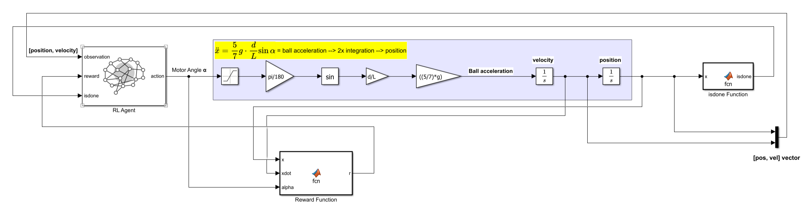

# BNB Simulink Model

`bnbRL_Simulink.slx` is the plant + RL Agent model used to train and evaluate the Ball-and-Beam controller. It's driven by `bnbRL_env.m` (which wraps it as a Gymnasium-style RL environment via `rlSimulinkEnv`) and run through `bnbRL_train.m` / `bnbRL_eval.m`.

<p align="center">
  
  <br>
  <em>Base Simulink Model</em>
</p>

## Signal flow

1. **RL Agent block** (`bnbRL_Simulink/RL Agent`) — takes `observation = [position, velocity]`, `reward`, and `isdone`, and outputs `action` = motor angle **α** (servo angle, deg).
2. **Plant dynamics** — implements the ball-and-beam equation of motion:

   ```
   ẍ = (5/7) * g * (d/L) * sin(α)
   ```

   α is saturated to the servo's valid range, converted from degrees to radians (`pi/180`), passed through `sin`, scaled by `d/L`, then by `(5/7)*g` to get ball acceleration. Two integrators (`1/s`, `1/s`) turn acceleration into velocity and position.
3. **Reward Function** (MATLAB Function block) — computes reward `r` from `x`, `xdot`, and `alpha`, fed back into the RL Agent.
4. **isdone Function** (MATLAB Function block) — checks `x` (and the `[pos, vel]` vector) to flag episode termination (e.g., ball falls off the beam), fed back into the RL Agent.
5. **`[pos, vel]` vector** — position and velocity are also muxed together as a bus output, used for logging/scoping and by `bnbRL_Animation.m`/`bnbRL_eval.m` outside the model.

## Notes

- Agent sample time and the plant constants (`d`, `L`, `g`, `Ts`, `x_max`, etc.) come from `bnbInit.m`, which must be run before opening/simulating this model (handled automatically by `bnbRL_env.m`).
- The initial position `x0` is randomized in `bnbRL_env.m`'s `ResetFcn` (±0.08 m) at the start of every training episode.
- `bnbRL_Simulink.slxc` and the `slprj/` folder are build caches — they're gitignored and regenerate automatically when the model is opened or run.
